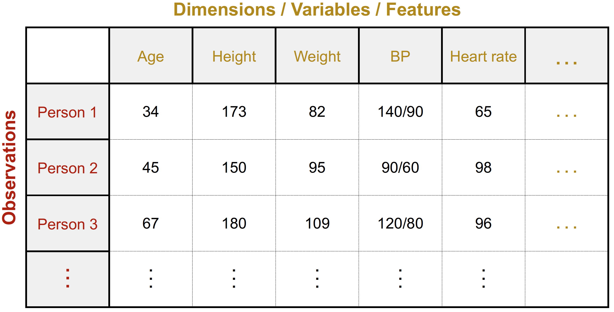
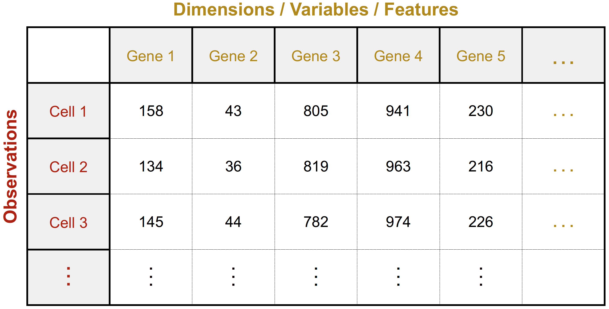
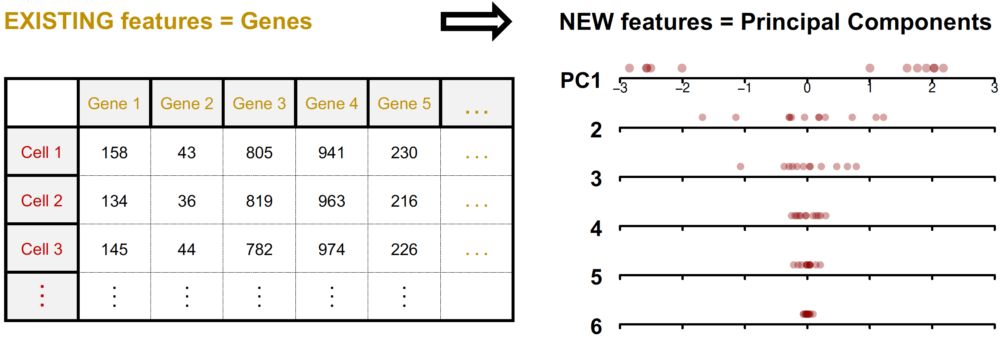
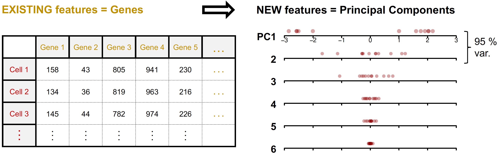
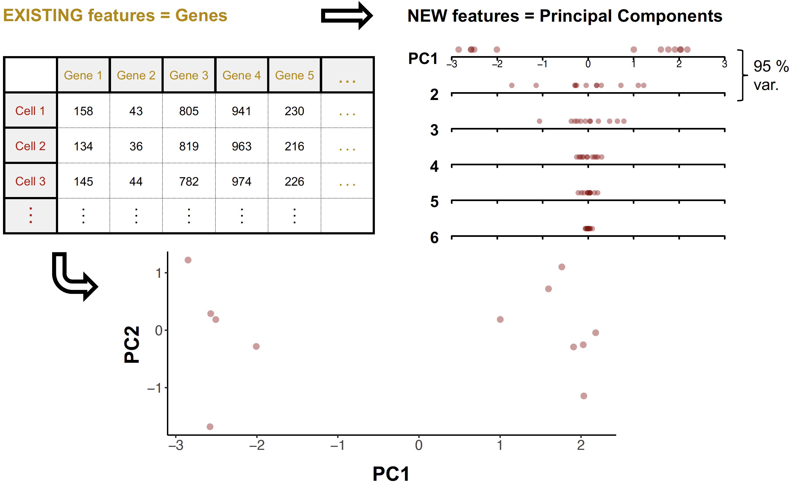

```{r setup, include=FALSE}
library(knitr)
opts_chunk$set(echo = TRUE, collapse = FALSE, message = FALSE, warnings = FALSE, 
               class.source = "code_format", class.output = "output_format")
```

<!-- So in this presentation, we will go through what Principal Component Analysis -->
<!-- or PCA is, why we might need it and we will walk through how to perform it in R.  -->

<!-- PCA is a powerful technique for dealing with complex, often high-dimensional data,  -->
<!-- with many features, which is commonly encountered in real-world scenarios. -->

## <span style="font-size: 25px">I. Data with many features common in real-world scenarios</span> {.build}

<!-- For instance, -->

<!-- in healthcare, if we would like to know what determines predisposition to a disease,  -->
<!-- we may have to deal with hundreds of features like demographics, vital signs, and  -->
<!-- other clinical data from several individuals. -->

```{r, echo=FALSE, fig.align="center", out.width="500pt"}
    
```

---

## <span style="font-size: 25px">I. Data with many features common in real-world scenarios</span> {.build}

<!-- in genomics, if we would like to study the brain, we may have to deal with thousands of  -->
<!-- gene features collected from several brain cells. -->

```{r, echo=FALSE, fig.align="center", out.width="500pt"}
    
```

---

## <span style="font-size: 25px">I. Data with many features common in real-world scenarios</span> {.build}

<!-- Extracting information from this type of data is challenging -->

<!-- Because it is hard to extract true, meaningful relationships between many features. -->
<!-- It may even be impossible if you have too many features and too few observations, -->
<!-- not enough to reflect those relationships accurately. -->

<!-- And it does not help that the data is hard to visualise in an interpretable way. -->

- Challenges

  - Hard to extract meaningful relationships between many features 
  - Hard to visualise

<!-- One solution to deal with high-dimensional data is to use techniques to reduce the  -->
<!-- dimensions by representing the data using fewer number of features.   -->

<!-- Some techniques achieve this by selecting only a few features -->
<!-- Whereas others, like PCA, do it without deliberately dropping any features. -->
<!-- Instead, they create and use fewer, new features derived from existing ones.  -->

- Solution - Reduce dimensions (number of features) 

  - Select only a few existing features
  - Use fewer new features derived from existing ones
  
## <span style="font-size: 25px">II. PCA reduces dimensions while retaining most information</span>

<!-- In PCA, these new dimensions or features are the principal components or PCs -->
<!-- - New features (dimensions) = principal components (PCs) -->
<!-- PCA reduces dimensionality -->
<!-- - PCA strives to capture (project) the most information or variation in the data  -->
<!-- in the **least number of PCs**  -->
<!-- This means that the first principal component (PC1) it derives -->
<!-- - First principal component (PC1) explains the most variation, followed by the  -->
<!-- second (PC2), and so on -->

```{r, echo=FALSE, fig.align="center", out.width="700pt"}
    
```

---

## <span style="font-size: 25px">II. PCA reduces dimensions while retaining most information</span>

```{r, echo=FALSE, fig.align="center", out.width="750pt"}
    
```

## <span style="font-size: 25px">II. PCA reduces dimensions while retaining most information</span>

```{r, echo=FALSE, fig.align="center", out.width="750pt"}
    
```

<!-- In the next slides, we will walk through how to perform PCA in R to represent or  -->
<!-- project this higher-dimension gene expression data in a more interpretable,  -->
<!-- lower-dimension PCA plot. Using only the first two components, PC1 and PC2, we  -->
<!-- could already see how subset of cells are more related to each other, demonstrating  -->
<!-- how PCA is useful for extracting patterns that be could starting points for further  -->
<!-- investigations. -->

---

## <span style="font-size: 30px">III. Performing PCA in R</span> {.build}

<!-- <!-- We will... --> 
<!-- 1. Apply PCA to data using **prcomp()** <!-- And then, use the output of that function to --> 
<!-- 2. Determine proportion of variation explained by each PC <!-- in order to decide how 
many PCs to use for making the PCA plot, which we could then interpret... --> 
<!-- 3. Make and interpret PCA plot  -->
<!-- <!-- 4. Visualise PCA loading values ( ~ correlation of each original feature to each PC) --> 

```{r generate dummy dataset, include=FALSE}

# Generate empty data table

set.seed(342)

data_df <- matrix(NA, nrow=12, ncol=5)

row.len <- nrow(data_df)
col.len <- ncol(data_df)

colnames(data_df) <- paste("Gene", 1:ncol(data_df), sep="")
rownames(data_df) <- paste("Cell", 1:nrow(data_df), sep="")

# Populate each row with fake data

for (col in 1:col.len) {
  
  clust1 <- rpois(5, lambda=sample(x=10:1000, size=1))
  clust2 <- rpois(7, lambda=sample(x=10:1000, size=1))
  clust3 <- rpois(0, lambda=sample(x=10:1000, size=1))

  data_df[,col] <- c(clust1, clust2, clust3)
  
}

data_df <- cbind(data_df, Gene6=rpois(12, lambda=sample(x=10:12, size=1)))
#

write.csv(data_df, file="./data/data.csv", row.names=TRUE)

```

**1. Load data**

<!-- Our data is stored as a CSV file so  -->

<!-- we start by loading it using the read.csv(), supplying the location of the file -->
<!-- We needed to also specify row.names=1 so the first column of the data will be used 
as row names. -->
<!-- The data is stored in data_df and -->

```{r load dataset}
  
  data_df <- read.csv("./data/data.csv", row.names = 1)
  data_df

```

```{r test center and scaling, echo=FALSE, eval=FALSE}
  
cent_data_df <- scale(data_df, center=TRUE, scale=FALSE)
scl_data_df <- scale(data_df, center=FALSE, scale=TRUE)
centscl_data_df <- scale(data_df, center=TRUE, scale=TRUE)

plot(scl_data_df[,1], scl_data_df[,2], 
     xlim=c(-2,2), ylim=c(-2,2))
abline(h=0,v=0)

plot(centscl_data_df[,5], centscl_data_df[,6],
     xlim=c(-2,2), ylim=c(-2,2))
abline(h=0,v=0)

```
  
---

**2. Apply PCA using prcomp()**

<!-- Now, we can supply our data to prcomp(). We set scale. to TRUE to specify that 
before, applying the method, the features should be put on the same scale to make
them comparable and to ensure that they are considered equally when deriving the 
principal components and variation explained. -->

```{r prcomp}
  
  pcaOut_list <- prcomp(data_df, scale. = TRUE) 
                      
```
  
---

<!-- The prcomp() returns a list of objects assigned to pcaOut_list. The x object is 
a matrix containing the PC values for each cell, and will assign it to pc_mx. -->

- 
  ```{r view PCs, R.options=list(width=4000)}
  
  pc_mx <- pcaOut_list$x # Matrix of PC values
  head(pc_mx)
  
  ```
```{r save PCs, echo=FALSE}
  
  save(pc_mx, file = "./data/pc_mx.RData")
  
```

<!-- In theory, the number of PCs that can be returned is equal to the number of 
original features, 6 genes in our case -->
<!-- so we have 6 PCs. -->
<!-- But because the goal of PCA is reduce the dimension of the data, we would need to  -->
<!-- choose the least number of PCs that already captures most of the variation in the data.  -->

<!-- To do that, we calculate the proportion of variation accounted for by each component, -->
<!-- using the sdev vector in the prcomp() output, assigned here to pc.sdev object.  -->
<!-- It contains the standard deviations for each component in the same order as pc_mx,  -->
<!-- with the standard deviation decreasing from PC1. So we can use the column names of  -->
<!-- the PC matrix to label the values in pc.sdev. -->

3. **Calculate proportion of variation explained by each PC**

<!-- We will square the standard deviation to get the variation accounted for by each component. -->

- 
  ```{r var from sdev}
  
  pcvar <- (pcaOut_list$sdev)^2
  
  ```
  
<!-- To determine which components account for most of the variation,  -->
<!-- we convert the variation into percentages relative to sum of variation.  -->

- 
  ```{r perc var}
  
  pcvar_perc <- pcvar / sum(pcvar) * 100
  
  ```

<!-- We round off to 4 decimal digits to make the values more readable as displayed here. -->

```{r perc var round name, echo=FALSE}
  
  pcvar_perc        <- round(pcvar_perc, digits = 4)
  names(pcvar_perc) <- colnames(pc_mx)

```
  
---

**4. Visualise percentage variation**

<!-- We can then create a scree plot to visualise the percentage of variation explained by  -->
<!-- each component in decreasing order.  -->

```{r scree plot code, eval=FALSE}
  
  barplot(pcvar_perc, main = "Scree plot", ylab = "Percentage variation")

```

```{r scree plot, echo=FALSE, fig.width=7, fig.height=5}
  
  barplot(pcvar_perc, main = "Scree plot", ylab = "Percentage variation",
          cex.names = 1, cex.axis = 1, cex.lab = 1.5)

```

<!-- With the scree plot, we can estimate at which component the variation levels off.  -->
<!-- This is often called the elbow and at this point, adding more components does not  -->
<!-- significantly improve the variance explained. So we could decide that using only the -->
<!-- components before the elbow would suffice. -->

<!-- In some cases, though, we could just look at the actual percentage values. Here,  -->
<!-- we can say that indeed a 2-D plot would be enough using PC1 and PC2, which in total already  -->
<!-- accounts for ~95\% of the variation in the data. -->

---

**5. Make and interpret PCA plot**

<!-- We could create a 2-D PCA scatter plot using the R base plot(). But here we will use the -->
<!-- R library ggplot2, widely used in R for making highly customisable plots with
relatively simple, readable code. -->

<!-- Here, we install it and load it using library().  -->

<!-- -  -->
<!--   ```{r install ggplot2, eval=FALSE} -->

<!--   install.packages("ggplot2") -->
<!--   library(ggplot2) -->

<!--   ``` -->
  
<!-- The ggplot() for making plots works with data frame objects so we will use the as.data.frame() -->
<!-- to convert the matrix of PC values, pc_mx, and store it in pc_df.  -->
<!-- Here, we add a column called label containing the row names or the cell name so we can have the  -->
<!-- option to label the points in the scatter plot.  -->

<!-- We make the plot using ggplot(). We supply the data frame of PC component values -->
<!-- and use the aes() to map the variables or columns in the dataframe to the visual  -->
<!-- property of the plot.  -->

<!-- We plot PC1 on the x-axis and PC2 on the y-axis using points of this size -->
<!-- We label the points using geom_text(), mapping the LABEL column to the label aesthetic -->

<!-- To help interpret the plot, we use geom_hline to draw dashed lines at y or PC2 equals 0 -->
<!-- and geom_vline to draw at x or PC1 equals 0. Using labs, we add the plot and axis titles,  -->
<!-- For a clarity and minimal appearance, we apply ggplot's classic theme. -->

<!-- geom_text(aes(label=LABEL), vjust=1.5, hjust=0.5) +  -->
<!-- geom_hline(yintercept=0, lty="dashed") + -->
<!-- geom_vline(xintercept=0, lty="dashed") + -->

```{r pca ggplot2}

  library(ggplot2)

  pc_df <- as.data.frame(pc_mx)

```

---

**5. Make and interpret PCA plot**

```{r pca plot code, eval=FALSE}
  
  ggplot(pc_df, aes(x = PC1, y = PC2)) +
    geom_point(size = 2.5, col = "#8B000059") +
      labs(x = paste("PC1", pcvar_perc[1], "%", sep=" "),
           y = paste("PC2", pcvar_perc[2], "%", sep=" ")) +
      theme_classic() 
      
```

```{r pca plot, echo=FALSE, fig.width=7, fig.height=3.25}
  
  pc_df$LABEL <- rownames(pc_df)
  ggplot(pc_df, aes(x = PC1, y = PC2)) +
    geom_point(size = 2.5, col = adjustcolor("darkred", alpha.f = 0.35)) +
      labs(x = paste("PC1", pcvar_perc[["PC1"]], "%", sep=" "),
           y = paste("PC2", pcvar_perc[["PC2"]], "%", sep=" ")) +
      theme_classic() +
      theme(axis.text.x =element_text(size=14), axis.text.y =element_text(size=14),
            axis.title.x=element_text(size=18), axis.title.y=element_text(size=18),
            plot.title=element_text(size=18)) #+
      #geom_text(aes(label=LABEL))
    
  ggsave("./data/pca_plot.pdf", width=7, height=3.25)
    
```

<!-- Finally, to interpret a PCA plot, it is important to consider the variation explained by the PCs,
that's why we included the values on the axes titles. In this plot, we see clustering of cells into two groups along PC1. Because PC1 explains around 80% of the variation, this difference between the clusters is likely to be significant and meaningful and is a good basis or starting point for further investigations.  -->

<!-- It's also important to note that while the other PCs may contribute to the overall pattern observed in the plot, they explain much less of the variation in the data compared to PC1. Therefore, we should be careful with interpreting their contribution. -->

---

## <span style="font-size: 30px">IV. Summary</span> {.build}

- Perform PCA in R to reduce dimensionality of data while retaining as much information as possible

<!-- - Reveal major underlying structure e.g. clusters -->
<!-- - Highly collinear / correlated variables -->

<!-- We have used the base function prcomp here, but it may also be good to use R packages  -->
<!-- with custom functions for comprehensive analysis and visualisation of PCA results. -->
<!-- This helps with more in depth analysis of your data without spending too much time -->
<!-- figuring out how to make the plots.  -->

- R functions for doing PCA in R
  - **prcomp()** from base R
  - **PCA()** from **FactoMineR** 

<!-- - [5 functions to do PCA in R](http://www.gastonsanchez.com/visually-enforced/how-to/2012/06/17/PCA-in-R) -->
  
<!-- - Suitability and limitations of PCA -->

<!-- It also important to check whether PCA is the right choice for your data -->
<!-- e.g. many variables but too few observations, data with many highly correlated features,  -->

<!-- However, it's important to note that there are some limitations to PCA. For example, the principal components are linear combinations of the original or existing features, so if there are no linear relationships in the data, then PCA may not be very effective. -->

<!-- END PRESENTATION HERE -->

<!-- SUPPLEMENTARY -->

---

**6. Interpret PC loadings**

<!-- To determine how the original features or genes influence this pattern, we can use the rotation -->
<!-- object in the pca output, which is a matrix of loadings per PC. We could think of it as 
the contribution of each gene to each principal component. -->

```{r pca plot ref, echo=FALSE, fig.width=7, fig.height=2.75, ref.label="pca plot"}
  
```

-
  ```{r loadings, R.options=list(width=4000)}

  head(pcaOut_list$rotation) # Matrix of loadings

  ```

---

**6. Interpret PC loadings**

<!-- To relate these to the pattern we see, can visualise the PC1 loadings along the PC1 dimension. -->
<!-- Genes with positive loadings are positively correlated with PC1, so their higher expression -->
<!-- pushes points to the higher end of PC1.  -->
<!-- Genes with negative loadings are negatively correlated with PC1, so their higher expression -->
<!-- pushes points to the lower end of PC1. -->

```{r pca plot ref 2, echo=FALSE, fig.width=7, fig.height=2.75, ref.label="pca plot"}
  
```
  
-
  ```{r loadings plot, echo=FALSE, fig.width=7, fig.height=3}

  pc1.loadings <- pcaOut_list$rotation[,"PC1"]

  xlim <- c(-0.6,0.6)
  ylim <- c(0,1)
  px <- round(sort(pc1.loadings), digits=4)
  py <- rep(0.05, length(px))
  lx.buf <- 0
  lx <- px
  ly <- c(rep(0.08,2), seq(0.2,0.5,0.1))

  ## create basic plot outline
  par(xaxs='i', yaxs='i', mar=c(8,4,1,1))
  plot(NA, xlim=xlim, ylim=ylim, axes=F, 
       ylab=" ",
       xlab=paste("PC1", pcvar_perc[["PC1"]], "%", sep=" "))
  title("Loadings", adj=0, line=0, font.main=1, cex.main=1.5)
  axis(side=1, cex.lab=1.5, cex.main=2)

  ## plot elements
  points(px,py,pch=1,xpd=NA, col="goldenrod3")
  abline(v=0, lty="dashed")
  text(lx,ly,names(px),pos=3, cex=1, col="goldenrod3")

  ```